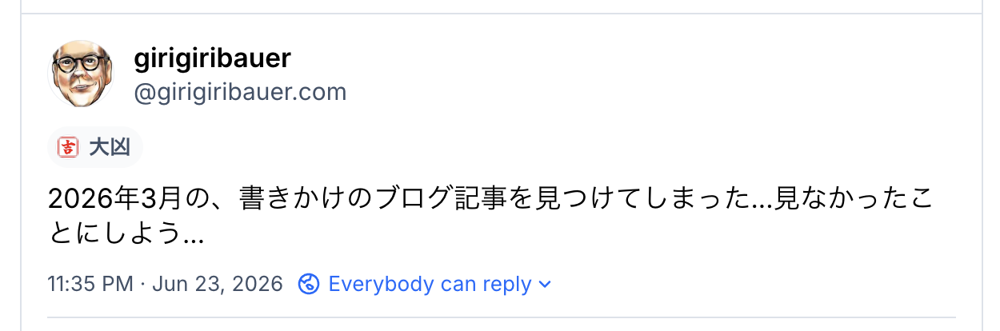
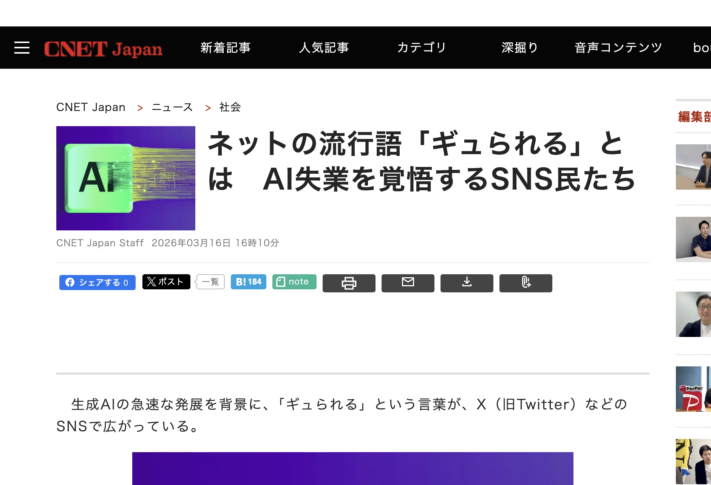
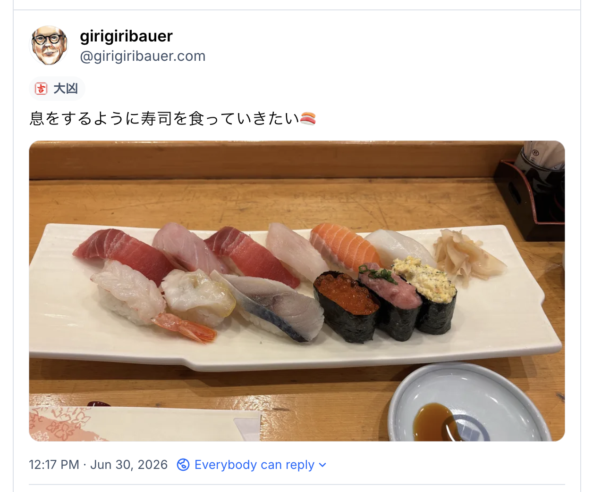

+++
title = "最近、自分のリソースをどこに投下すべきかわからなくなってきた話"
description = "AI時代になってきたというのにその変化をブログに全然書いてなかったことに気づいたので"
date = "2026-07-07T09:00:00+0900"
draft = false
tags = ["AI"]
+++

ポエムです。

## 何の技術書を買えばいいかわからない

最近、 **技術書で何を買って読めばいいのか** 分からなくなってきました。

https://bsky.app/profile/girigiribauer.com/post/3mon27g2jic2t

ブログには書いてませんでしたが、
いつのまにか IT/Web の業界は自分でコードを書く世界ではなくなりつつあって、
AI に如何にしてコードを書かせるか？という技術トピックばかりになってきました。

たぶん読むべきは技術書以外の別業界の本なんでしょうけど、
（実際技術書以外にだいぶ偏ってきてます）
いざ技術書を買ったとしても、手元でAIに聞いた方が早いよねになっちゃうと思うんですよね。

もう本当に最近何買ったらいいかわからない。
たぶん書く側の人も困ってそうな気がします。

## 何の記事を書けばいいのかわからない

最近、 **`tech` カテゴリーの記事で何書けばいいのか** 分からなくなってきました。

https://bsky.app/profile/girigiribauer.com/post/3moxmqlqjts2h

テック記事も結構な割合の人がAIに書かせているようで、
一番下の行に、 **「このブログ記事はAIに書かせました」** と書いてあると **若干萎えます。**
もしかすると知らずに読んでるものもきっといくつかあるでしょう。

ちなみにこのブログはどちらでしょうか？当ててみてください :sunglasses:

技術的なこだわりも最近意識的に捨てようとしていて、
昔はエディタがこれ、こういうカスタマイズをして、ショートカットでこれが動くようにする！
みたいなのを頑張ってたし、そういう記事も昔いくつか書いた記憶はありますが、
今は標準の設定に体を慣れさせることを優先していて、極力 **こだわりを捨ててレールに乗ろう** としています。

例えば tmux のプレフィックスキーも、昔は `Ctrl+J` に割り振って右手人差し指の特等席を譲ってたのが、
今はデフォルトの `Ctrl+B` に変更し直して、大きい船が来た時に気軽に乗れるように心がけています。
（実際 Antigravity から `Ctrl+J` を求められたのがきっかけだった気がする）

いや、むしろ tmux すらもはや捨ててしまってもいいくらい。
もう全然こだわってません。

さて、こだわりがないのなら、じゃあAIの記事でも書くか？って言ったら、
そんな足の速い記事書いたところですぐに腐って正しくない情報になるだけだし、
なによりも面白みがない。

行き着く先はAIが完全自動で書くAIの記事ですよね。
いや、必要に応じて読みはするかもだけど、自分で書こうとは思わない。うーん。

## ギュられる危機感・焦燥感

シンギュラリティが来てAIに仕事を代替される現象を **『ギュられる』** と言うらしいです。

https://japan.cnet.com/article/35245089/

日本はこれからどんどん人が少なくなるので、
仕事を選り好みしなければ飯は食っていけるでしょうけど、
ある日突然、今まで自分が提供していたものの価値が、AIによってゼロとなりました、となるのは怖いですね。

昔はコミュスキルが多少なくても（とはいえ下限はあるけど）、
IT/Web のスキルが一定基準あれば、価値の提供はできたよね、という時代でしたが、
もうそれも終わりつつあります。

残念、 **IT業界はもうなくなりました。**

そんな業界もうありません。
ちゃんとそれぞれのビジネスモデルで稼げるか？がやはり大事で、「お仕事はITです」はもうない。

**早い。**

いつかIT自体の業界は無くなるとは思ってましたけど、予想以上に早すぎる。

そして、もっと他の業種からだと思ってたのが、
**実は一番デジタル化されてる IT/Web のお仕事こそがAIに代替されやすかったというオチつき** ですよね。

| 仕事を選り好みしなければ飯は食っていけるでしょうけど、

焦燥感を感じるたびに自分でこれを繰り返してます。
たぶん必要以上に焦る必要はなくて、 **本能で焦らずに理性で焦るようにしたい。**

## かき混ざってない感

たぶんこれから産業革命の時に起きた変化以上の波がさまざまな業界に時間差で押し寄せてくることになる（なってる）と思うんですけど、
人間の変化って（別に種として進化したわけじゃないので）たぶん早くしようがなくて、
昔から変化に早く飛び付ける人と中くらいの人と遅めの人に分かれるじゃないですか。

今は変化が一部分しか起きてなくて、 **すごくかき混ざってない感を感じる** んですよ。

たぶんコードだけを書いてた仕事の人が変化の波をいち早く受けていて、
つまりかき混ざってない部分にいて、ちょうど仕事が減ってきた、外注してた人は仕事が出せなくなってきた、みたいな感じなんでしょうか？

なので、今かき混ざってない部分にいる人の生存戦略としては、
**他業種にできるだけ目を向けて、他業種の人たちとできるだけたくさん会う** 、というのが正しい気がするんですよね。

なんかこうかき混ぜたいんですよ。色々と。

## 未来が予測できない世界

世界の変化が早すぎてもはや予測が意味をなさなくなってきてると思うんですよね。

そう、だから自分のリソースをどこに投下すべきかわからなくなってきてるのかもしれません。

それでも無理矢理予想してみるなら、人に接する部分はどうやってもなくならないと思うので、たぶんこの辺とか？

- **プロジェクトやプロダクトをマネジメントする人** 、 PjM とか PdM とか？
    - 実際需要がけっこうあるらしい（と聞いた）
    - 要望を仕様として言語化できれば、その先の作るところはもうお任せで良さそう
- **ユーザーインターフェースを作ったりデザインする人** ？
    - なんだかんだで人間に触れる部分で、正解が人間の中にある
    - AIエージェント同士がやりとりするようになっても、人間がいなくなるわけじゃないから一定残りそう
- **AIを導入サポートする人** ？
    - 実際みんながみんなAI活用できてるわけではない

もちろん、一部のトップエンジニア・トップクリエイターみたいな人はこのまま価値を提供し続けられるでしょうけど、
そうじゃない **~~凡人~~ 一般人はどうすればいいのか？**

- **人の中に正解があるもの** を対象にお仕事をする（つまり人と接しながらこれまでのスキルを活かす）
    - 答えがコードの外、人間の中にある類のものは、AIで代替できなさそう
- 異業種に片足突っ込んで、 **掛け合わせで価値提供** してみる
    - 理解は武器になる。理解してないと適切な答えを導けない
- あえて **AIが使えないところ** に飛び込む
    - 法律上、職業が守られているところ
    - いろんな都合上、AIが導入できないところ

分からんけど、無理やり捻り出してみるとこんな感じ？

**やー難しいね。AIに聞こうか？w**

## まとめ（られない）

ポエムなのでまとめなどない。

ないけど、まあ **AIに出来ないことを積極的にやっていこう** ってことなんじゃなかろうかと。

https://bsky.app/profile/girigiribauer.com/post/3mpi23iswf22r

AIに寿司は食えない、ガハハ :sunglasses:

（この記事は全部人間が書きました）
