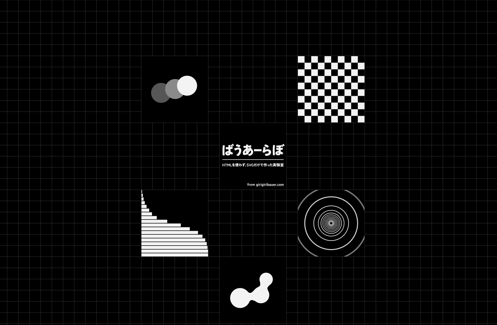
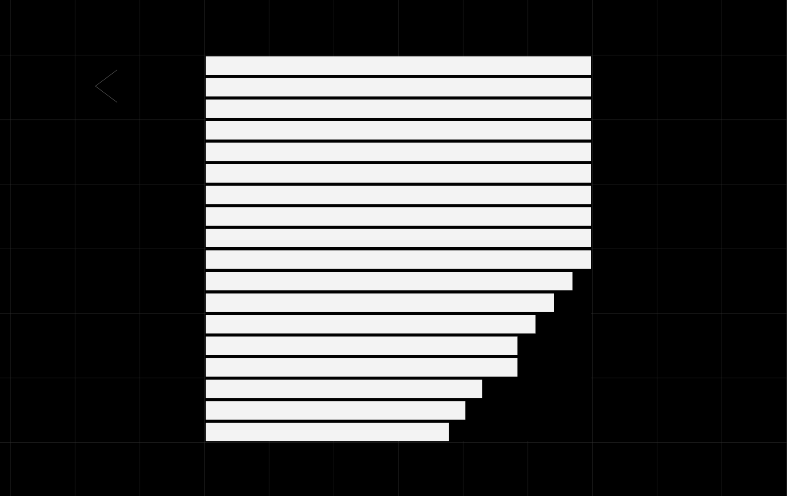

+++
title = "往年のフル Flash のような全編 SVG の Web サイトを作ってみた話"
description = "昔からやりたかった全編 SVG の Web サイトをようやく作りました...！"
date = "2026-08-18T08:15:00+0900"
draft = false
tags = ["SVG"]
+++

## お盆休みを使って誰の役にもたたない自己満足の全編 SVG の Web サイトを作ってみた

やー楽しかったw 昔からやりたかったんですよ🤭



https://lab.girigiribauer.com

まずは概要だけ。

- 作品集やアトリエではなく、あくまで **工夫のログ** という位置付け
- 文章系は『ばうあーろぐ』に書き、コンテンツ系は『ばうあーらぼ』に書く
- 往年のフル Flash と同じく読み込んだら全面で展開してくれるやつ
    - History API とかがあるので、ちゃんと詳細でも URL が割り振れる
    - SVG だから **iPhone でも動く！** （動作確認済み）
- とりあえず5つ分公開したけど、順次工夫をメモりたかったら追加したい

アクセスしたら `index.html` じゃなくて `index.svg` ですよ？
イケてませんか？クールでしょ？w

## もやもや

頭の片隅にずっとやりたいなー、でもそんなことやってる暇ないよなー、というのがずっと残っていて、
着手しはじめちゃったらそれなりに時間もかかるので、忘れようと思っていたものが、
ある日突然大きくなってきてました。

よくよく考えてみると、実装コストも今下がってきてるし、工夫をメモることの意義も高まってきてるので、
お盆休みにやってしまえばいいのでは？という気持ちになってきて、とうとうやってしまいました。
（他にやるべきタスクは山ほどあったのに...）

## 各種トレードオフ

SVG で Web サイトを提供するにあたって、色々なトレードオフがありました。

- `og:image` が設定できない（OpenGraph 系のメタタグが設定できない）
- `viewport` がない
- SVG には `<title>` 要素と `<desc>` 要素しかない
- 検索エンジンへの対応
- だいぶマシになったとはいえ、ブラウザごとの差異が HTML より大きい

以下でそれぞれ詳しく。

### og:image をはじめとした OpenGraph 系のメタタグもない

HTML ではないのでメタタグがないんですよ。

フル Flash コンテンツのように、 HTML の中に全面 swf ファイルを埋め込んで表示するように、
全面 SVG を埋め込んで表示する方がそういったメタタグが書けるので大きなメリットはあります。

ただこれもトレードオフで、 `index.svg` にアクセスして Web サイトを提供する、
というかっちょいいことをやりたいのであれば、一定許容すべき項目です。

ただ、 SNS でシェアしようとしたときもリンクカードに画像が表示されないのはさすがに困るので、
そういった SNS 系の bot 向けには og:image 入りの HTML をやむを得ず提供しています。
この辺のさじ加減は悩ましいですね。

```nginx
map $http_user_agent $index_file {
    default                                        index.svg;
    "~*(twitterbot|facebookexternalhit|facebot)"   ogp.html;
    "~*(slackbot|discordbot|telegrambot|whatsapp)" ogp.html;
    "~*(bluesky|bsky|mastodon|pleroma|misskey)"    ogp.html;
    "~*(linkedinbot|pinterest|redditbot|hatena)"   ogp.html;
    "~*(embedly|iframely|skypeuripreview)"         ogp.html;
}
```

ただこの og:image も SVG で作った画像を元にしているので、できる範囲で一通り SVG にはなってます。あと favicon も。

### viewport もメタタグなので当然ない

HTML ではないので viewport 設定もないんですよ。

ちなみに iPhone だと viewport 指定がない場合は 980px 相当で表示されることになっています。
指定はできないので、後述のようなことを何もしなければ 980px で用意しておく必要があります。

ただし **viewport meta がない代わりに viewBox 属性があります。**
SVG で全面で出しつつ、 viewBox 属性に適切な数値を指定してあれば、内部のコンテンツはその大きさで表示されるので、実質 viewport を指定したかのようなサイズ感で調整できるのではないでしょうか？（ちなみに今回の Web サイトでは、標準サイズで違和感なかったので、トップレベルの SVG ではそこまではやってません）

### title と desc しか文字を書く場所がない

どういうところに工夫ポイントがあるのか？というのは、一定文章に残しておきたい気持ちはありつつも、
全体的には文字で説明するよりは触ってて気持ちいい動きだとか、見た目に訴えかけるものを残しておきたいので、
title と desc 要素しか文章を書ける場所がないのはそこまでデメリットにはならないなと感じてました。

なんだかんだで title と desc だけなら様々な媒体からざっくりタイトル、説明文として解釈してくれるんですよね。
そういう点では PDF の直リンクよりも優秀です。

### 検索エンジンへの対応

検索エンジン向けにも og:image と同じ対応をしてしまうと、
今度は **人間と検索エンジン向けにコンテンツを出し分けているというクローキングという行為に相当** してしまい、
スパム扱いされてしまいます。

なので、さっきの SNS 系 bot 向けの対応の中に検索エンジンは入っておらず、
人間と同様の SVG コンテンツを見せています。

どこまで解釈してくれるのかは未知数ですが、トップレベル SVG の desc 要素に **HTMLを使わず、SVGだけで作った実験室** と書いてあるので、あとはよしなに解釈してくれるでしょうw

### ブラウザごとの差異

ここは確認すればいいだけなので大きな問題ではないです。
そこまでブラウザごとに SVG 周りでできないことって、今はそんなに多くないです。

むしろ iPhone がサポートに入ることによって、
往年のフル Flash コンテンツのようなものが iPhone でも閲覧できて、
タッチで反応させられる、ということの方がメリットが大きいように思います。

## 原体験

1つ目のコンテンツとして **『ぴったり』** を用意してます。

昔どこかのブログ記事で読んだのですが、マウスやタッチで触れたものを普通にイージングするだけだと、こんなに綺麗に揃わないんですよねえ。

工夫として、マウスやタッチで触れたものを **まずいきなり90%くらいに伸ばして** 、すぐに100%まで短時間アニメーションさせて、
 **少し余韻を持たせた後** で、戻すときは **ゆっくり普通に戻す** 、というイージングのさせ方を工夫することで、順に触った瞬間にトップレベルが **すべて綺麗に揃って気持ちいい** ってなるんですよね。たぶん説明してもらわないとわからない。



https://lab.girigiribauer.com/items/pittari/

昔そのブログを読んで Flash で比較しつつ触れるようになっててそれで感銘を受けたので、これは残しておかないと、と思って1つ目に用意してみました。

今後こういう工夫をどんどんメモって残していきたいですね。
こういう気持ちいいって感じる感覚は AI にはきっと理解してもらえないので。（将来されてたらそれはそれで泣くけど）

---

で、 ブログ記事を書いてリンクカードを表示しようとしたら、早速 og:image が表示されないのは SVG だからでしたw
